# CamPulse — Architecture Design Document

> **Version:** v2026 · **Platform:** Next.js 16 (App Router) · **31 source files · 8,347 LOC**  
> **Institution:** KKW College of Engineering · **Last Updated:** April 2026

---

## 1. High-Level System Architecture

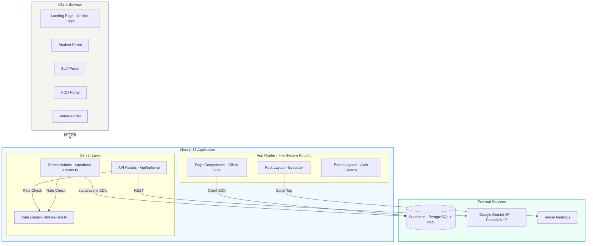

---

## 2. Application Layer Architecture

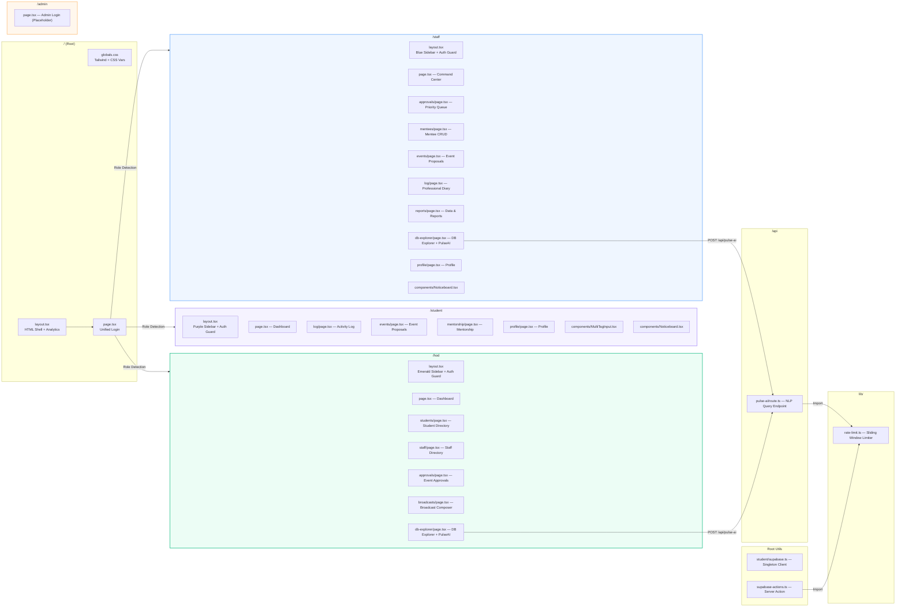

---

## 3. Complete File Tree (31 Files)

```
CamPulse/
├── app/
│   ├── layout.tsx ·················· Root HTML layout, Vercel Analytics, global CSS
│   ├── page.tsx ···················· Landing page — unified login (cascading role detection)
│   ├── globals.css ················· Tailwind directives, CSS custom properties
│   │
│   ├── student/ ···················· 🟣 STUDENT PORTAL (Accent: #A78BFA)
│   │   ├── supabase.ts ············ Singleton Supabase client (shared across ALL portals)
│   │   ├── layout.tsx ············· Collapsible sidebar, mobile bottom bar, auth guard
│   │   ├── page.tsx ··············· Dashboard — bento grid, engagement pulse, noticeboard
│   │   ├── log/page.tsx ··········· Dual-tab activity logger (Log New + My History)
│   │   ├── events/page.tsx ········ Event proposal form & history tracker
│   │   ├── mentorship/page.tsx ···· Mentor profile card & validation history
│   │   ├── profile/page.tsx ······· Read-only academic profile & password reset
│   │   └── components/
│   │       ├── MultiTagInput.tsx ·· Reusable animated multi-select tag component
│   │       └── Noticeboard.tsx ···· HOD broadcast reader widget (student variant)
│   │
│   ├── staff/ ····················· 🔵 STAFF PORTAL (Accent: #60A5FA)
│   │   ├── layout.tsx ············· Staff sidebar, mobile nav, auth guard, notification badges
│   │   ├── page.tsx ··············· Command Center — metrics, mentees grid, noticeboard
│   │   ├── approvals/page.tsx ····· Priority Queue — approve/reject student activities
│   │   ├── mentees/page.tsx ······· Mentee CRUD, bulk .xlsx import, drilldown timelines
│   │   ├── events/page.tsx ········ Faculty event proposal form & history
│   │   ├── log/page.tsx ··········· Professional Diary — slide-over form, timeline, PDF
│   │   ├── reports/page.tsx ······· Data & Reports — date filtering, PDF/CSV export
│   │   ├── db-explorer/page.tsx ··· DB Explorer — table browser + PulseAI NLP (812 LOC)
│   │   ├── profile/page.tsx ······· Faculty profile & password management
│   │   └── components/
│   │       └── Noticeboard.tsx ···· HOD broadcast reader widget (staff variant)
│   │
│   ├── hod/ ······················· 🟢 HOD ECOSYSTEM (Accent: #10B981)
│   │   ├── layout.tsx ············· HOD sidebar, mobile nav, auth guard
│   │   ├── page.tsx ··············· Dashboard — pending approvals, counts, action center
│   │   ├── approvals/page.tsx ····· Event Approvals — 3-tab (pending/approved/rejected)
│   │   ├── broadcasts/page.tsx ···· Broadcast Composer — send notices to dept
│   │   ├── students/page.tsx ······ Student Directory — search, drilldown dossier
│   │   ├── staff/page.tsx ········· Staff Directory — diary + mentees tabs
│   │   └── db-explorer/page.tsx ··· DB Explorer — table browser + PulseAI NLP
│   │
│   ├── admin/ ····················· 🟠 ADMIN PORTAL (Accent: #FDBA74)
│   │   └── page.tsx ··············· Standalone admin login (hardcoded, placeholder)
│   │
│   └── api/ ······················· SERVER-SIDE API ROUTES
│       └── pulse-ai/route.ts ····· PulseAI NLP endpoint (Gemini model fallback chain)
│
├── lib/
│   └── rate-limit.ts ·············· In-memory sliding-window rate limiter
│
├── supabase-actions.ts ············ Server action for rate-limited student activity updates
├── tailwind.config.ts ············· Custom Neumorphic design tokens
├── next.config.ts ················· Turbopack configuration
├── tsconfig.json ·················· TypeScript compiler options, @/* path alias
├── postcss.config.mjs ············· PostCSS + Autoprefixer
├── eslint.config.mjs ·············· ESLint flat config (Next.js + TS)
└── package.json ··················· Dependencies & scripts
```

---

## 4. Authentication & Session Flow

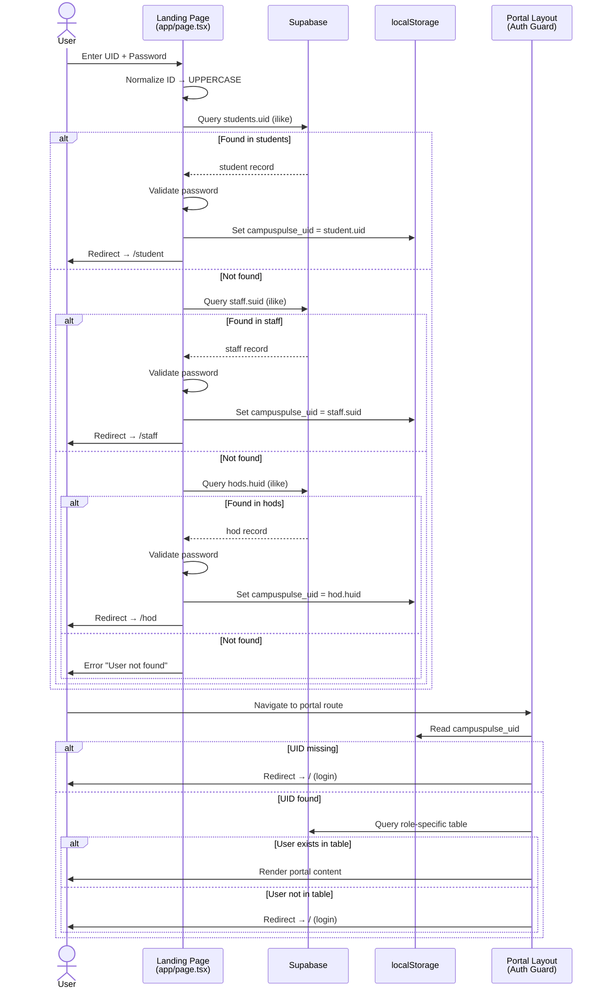

---

## 5. Database Schema (Entity-Relationship Diagram)

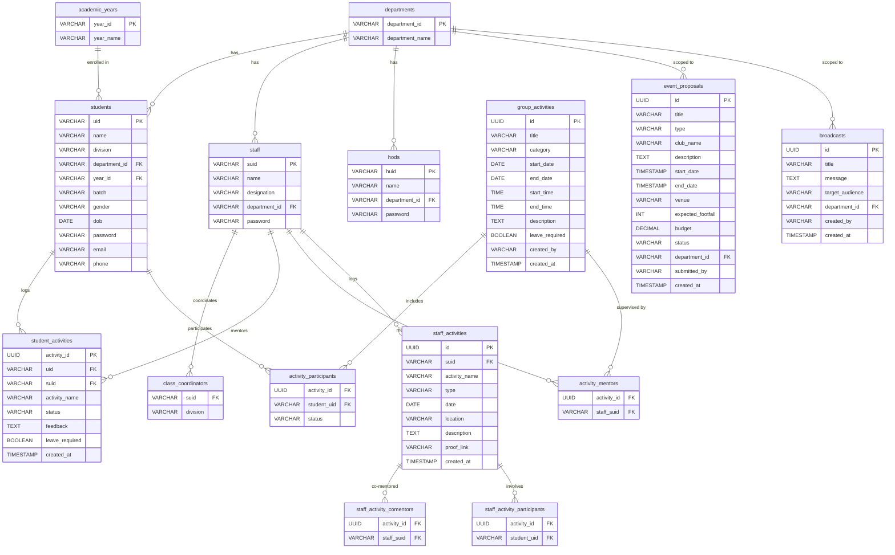

---

## 6. Technology Stack Diagram

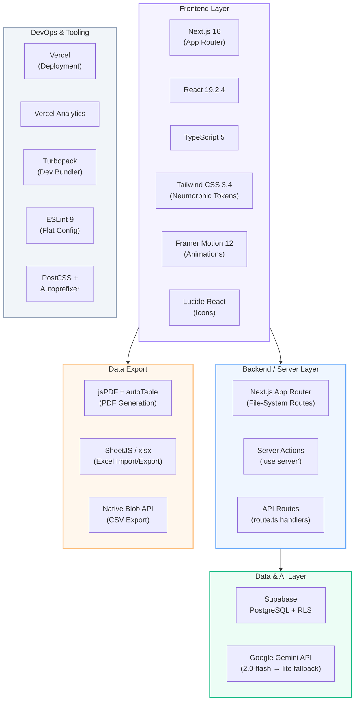

---

## 7. PulseAI — NLP Query Pipeline

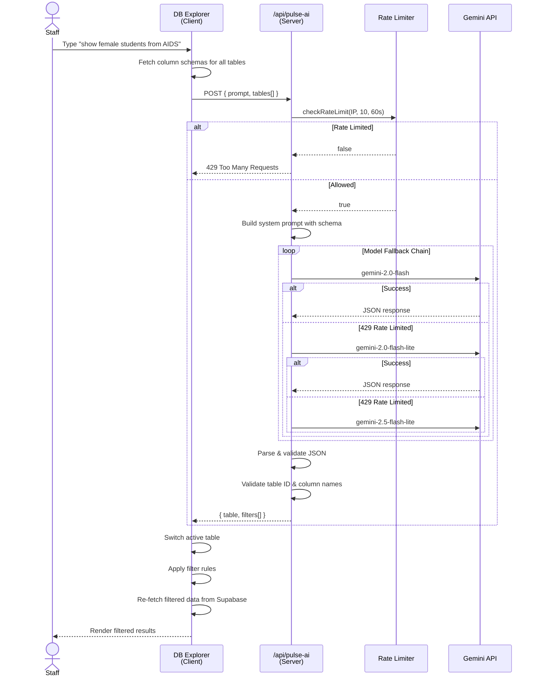

---

## 8. Data Flow — Activity Lifecycle

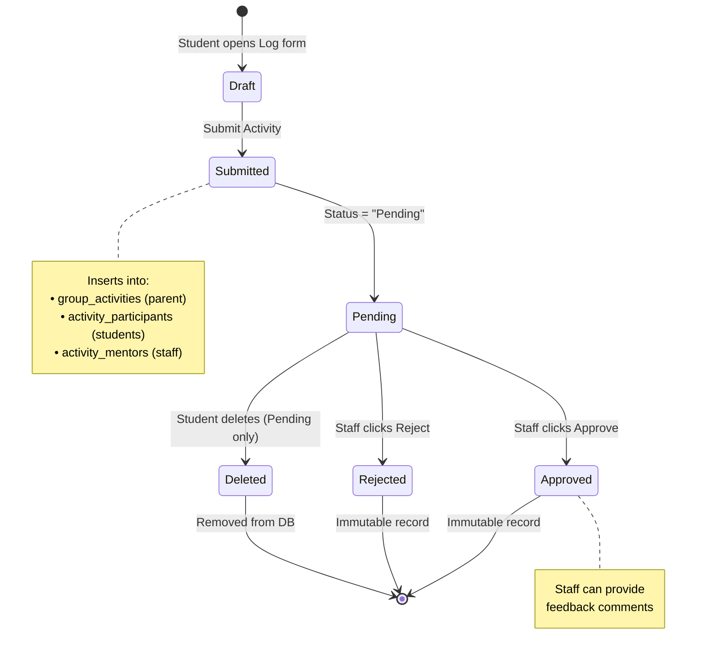

---

## 9. Event Proposal Workflow

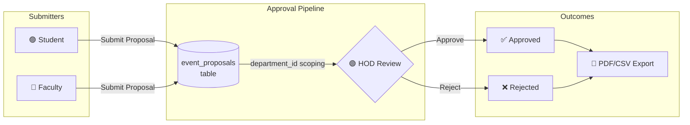

---

## 10. Broadcast System

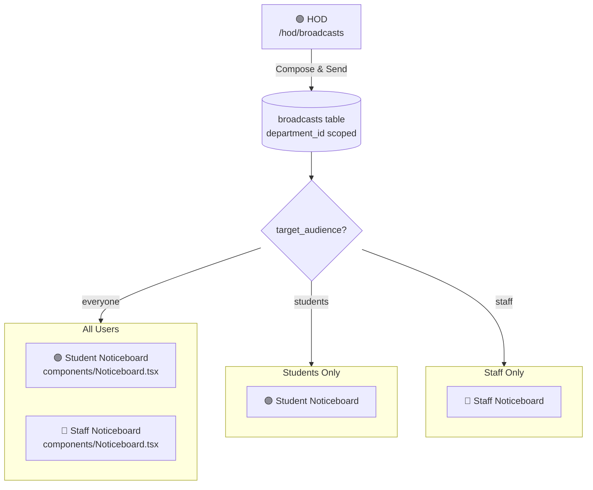

---

## 11. Portal Feature Matrix

| Feature | 🟣 Student | 🔵 Staff | 🟢 HOD | 🟠 Admin |
|---|:---:|:---:|:---:|:---:|
| Dashboard with Metrics | ✅ | ✅ | ✅ | ❌ |
| Activity Logging | ✅ | ✅ (Diary) | ❌ | ❌ |
| Activity Approvals | ❌ | ✅ | ❌ | ❌ |
| Event Proposals | ✅ | ✅ | ❌ | ❌ |
| Event Approvals | ❌ | ❌ | ✅ | ❌ |
| Mentee Management | ❌ | ✅ (CRUD + .xlsx) | ❌ | ❌ |
| Student Directory | ❌ | ❌ | ✅ | ❌ |
| Staff Directory | ❌ | ❌ | ✅ | ❌ |
| Broadcasts (Send) | ❌ | ❌ | ✅ | ❌ |
| Noticeboard (Read) | ✅ | ✅ | ❌ | ❌ |
| PDF/CSV Export | ❌ | ✅ | ✅ | ❌ |
| Bulk Import (.xlsx) | ❌ | ✅ | ❌ | ❌ |
| DB Explorer + PulseAI | ❌ | ✅ | ✅ | ❌ |
| Mentorship View | ✅ | ❌ | ❌ | ❌ |
| Profile & Password | ✅ | ✅ | ❌ | ❌ |

---

## 12. Design System Architecture

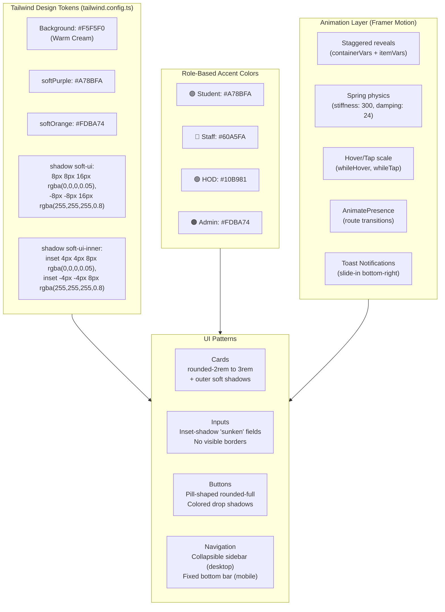

---

## 13. Deployment Architecture

```mermaid
graph LR
    subgraph Dev["Development"]
        Local["localhost:3000<br/>npm run dev"]
        TB["Turbopack<br/>(HMR)"]
    end

    subgraph Build["Build Pipeline"]
        NB["next build<br/>(Production)"]
        ESL["ESLint Check"]
        TSC["TypeScript<br/>Compilation"]
    end

    subgraph Prod["Production (Vercel)"]
        Edge["Vercel Edge<br/>Network"]
        Serverless["Serverless<br/>Functions"]
        Static["Static Assets<br/>CDN"]
    end

    subgraph Services["External Services"]
        SB[(Supabase Cloud)]
        GeminiCloud["Gemini API"]
        Analytics["Vercel Analytics"]
    end

    Dev --> Build
    Build --> Prod
    Prod --> Services

    style Dev fill:#fff7ed,stroke:#FDBA74
    style Prod fill:#ecfdf5,stroke:#10B981
```

---

## 14. Environment Configuration

| Variable | Scope | Purpose |
|---|---|---|
| `NEXT_PUBLIC_SUPABASE_URL` | Client + Server | Supabase project endpoint |
| `NEXT_PUBLIC_SUPABASE_ANON_KEY` | Client + Server | Supabase anonymous key (RLS enforced) |
| `GEMINI_API_KEY` | Server only | Google Gemini API key for PulseAI |

---

## 15. Rate Limiting Architecture

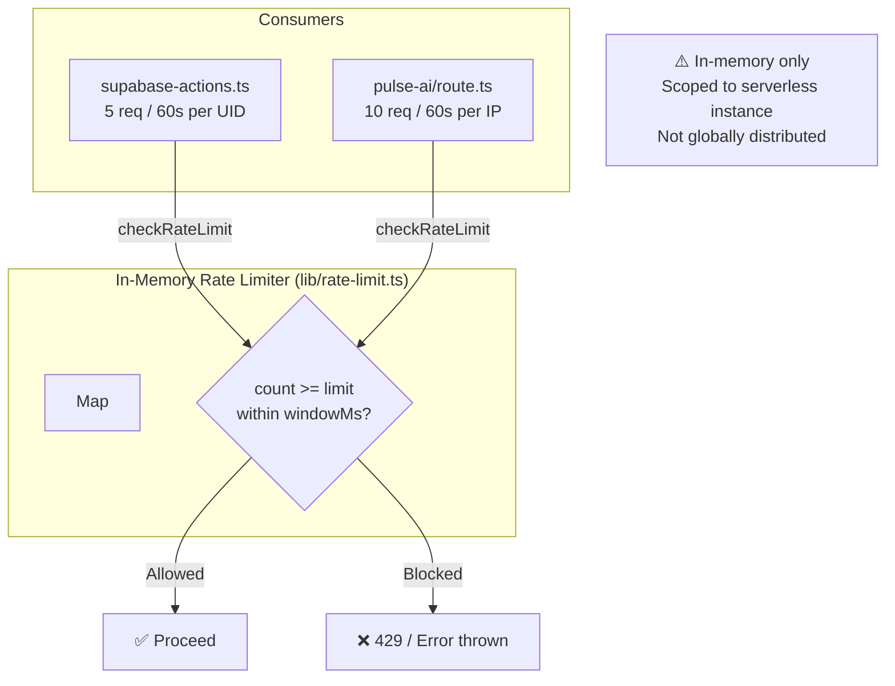

---

## 16. Key Architectural Decisions

| Decision | Rationale |
|---|---|
| **Unified login page** (cascading table queries) | Simplifies UX — single entry point for all roles |
| **localStorage session** (not JWT/cookies) | Lightweight client-only auth; acceptable for internal college tool |
| **Singleton Supabase client** (`student/supabase.ts`) | Shared across all portals to avoid multiple instances |
| **Dual activity schemas** (legacy + group) | Backward compatibility with original `student_activities` table |
| **Normalized group activities** (1:N:M) | Avoids N×M row duplication for multi-participant events |
| **Client-side PDF/CSV generation** | No server load; jsPDF + autoTable runs entirely in browser |
| **Gemini model fallback chain** | Resilience against 429 rate limits from individual models |
| **`department_id` as VARCHAR** | Prevents PostgreSQL type mismatch across tables |
| **`"use client"` on all pages** | Full Framer Motion animation support; no SSR constraints |
| **In-memory rate limiter** | Good enough for single-instance; Redis upgrade planned |

---

*Generated from exhaustive analysis of all 31 source files (8,347 LOC) across the CamPulse project.*
